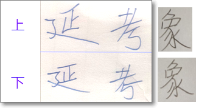
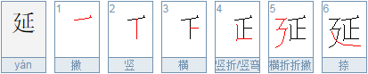
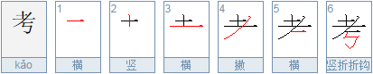
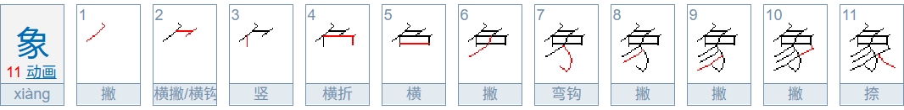
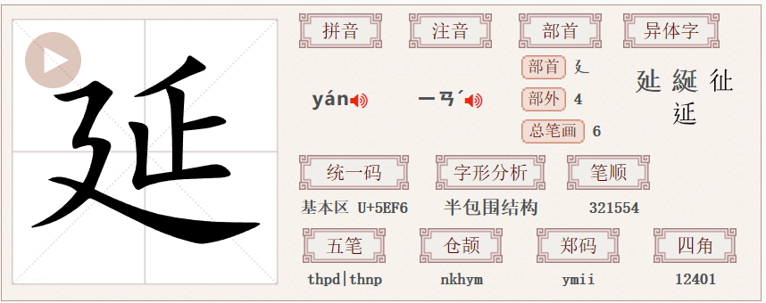
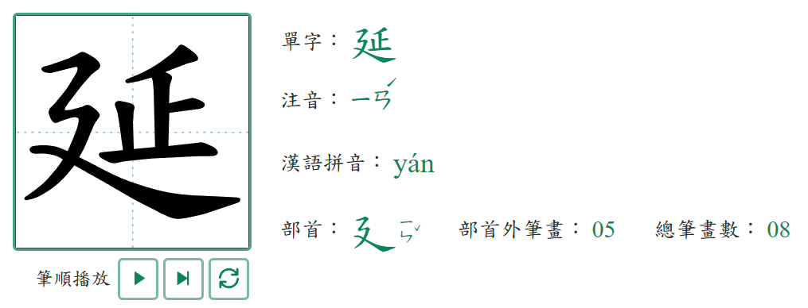
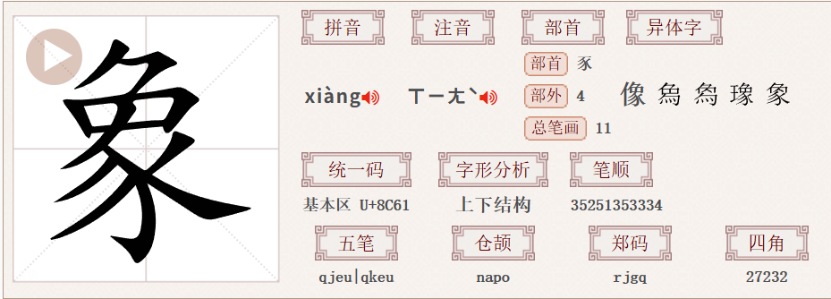
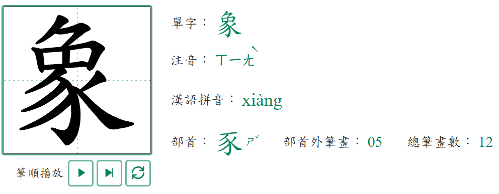

# 极易写错的汉字：延，考，象

[Index](index.md)

「延」、「考」和「象」这几个字在手写时，极易写错，而且作者不察，读者亦不察！

请看下面两种写法：

粗看去上下基本上一致，况手写时本来就有笔画变形，其实，上面为中国大陆简体的规范写法，下面是异体或误写，具体说明如下：

「延」字右上部分的第四笔是竖折，而非分开的两笔：竖与横。

「考」字右下部分的横，在折笔之上。

「象」字中间起笔的撇（下图第6笔），穿过了中间的「口」的下面的横的。

上面的笔顺图和两字的笔顺演示可参：

1. 「延」<http://bihua.51240.com/e5bbb6__bihuachaxun/>
2. 「考」<http://bihua.51240.com/e88083__bihuachaxun/>
3. 「象」<https://bihua.bmcx.com/e8b1a1__bihuachaxun/>

当初之所以发现「延」的书写问题，是因为我用手机笔画输入法时，总是打不出这个字，才知道自己写错了。可叹，可叹！

## 「延」「延」「象」「象」特别说明

「延」和「延」，「象」和「象」，是同一个字的两种不同字形，它们的差异不是简繁体的差异，而是因为互为异体字而已。我前面用手机笔画输入法打不出来，是因为平常写的字形和手机里的不同。或许手机可以搞个兼容模式，对这种非常近似的异体字合并处理，提升用户体验。

在中国用的是「延」，参 <https://www.zdic.net/hans/%E5%BB%B6>

在台湾用的是「延」，可以在[这里](https://dict.mini.moe.edu.tw/SearchIndex/word_detail?wordID=D0003569&breadcrumbs=Search_%E5%BB%B6_one&dictSearchField=%E5%BB%B6)查到。

在中国用的是「象」，参 <https://www.zdic.net/hans/%E8%B1%A1>

在台湾用的是「象」，可以在[这里](https://dict.mini.moe.edu.tw/SearchIndex/word_detail?wordID=D0002772&breadcrumbs=Search_%E8%B1%A1_one&dictSearchField=%E8%B1%A1)查到。

需要说明的是，「延」在Unicode中只有一个码点（U+5EF6），但中国大陆和台湾的字体设计不同，导致字形有所差异。
