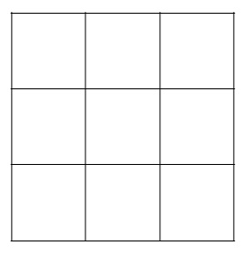

# 九宮格（河图洛书）

[返回目录](index.md)

_2024.02.11 农历正月初二_

按：这里谈到的九宫格不是数独。很多资料认为本文所述的九宫格叫[「河圖洛書」](https://zh.wikipedia.org/zh/%E6%B2%B3%E5%9C%96%E6%B4%9B%E6%9B%B8)，有兴趣了解周边故事的话，可以点开前面的链接看看。

一个正方形被划分为三行三列，共九个小正方形。在这九个小正方形中各填入一个数字。

（后续为方便打字，用3X3矩阵表示九宫格）

$$
\begin{bmatrix}
A & B & C \\
D & E & F \\
G & H & I
\end{bmatrix}
$$

这些数字满足：各行各列的数字和相等，并等于对角线上的数字和。

- 横行和：A + B + C = D + E + F = G + H + I
- 纵列和：A + D + G = B + E + H = C + F + I
- 斜向和：A + E + I = C + E + G
- 横向和 = 纵列和 = 斜向和

最简单的一个九宫格就是在九个格子中分别填上1~9的九个数字，数字的数量关系满足上面所述：

$$
\begin{bmatrix}
8 & 1 & 6 \\
3 & 5 & 7 \\
4 & 9 & 2
\end{bmatrix}
$$

对它转置和交换不相邻两行（列），新矩阵还是能满足九宫格游戏的条件，即：

$$
\begin{bmatrix}
8 & 3 & 4 \\
1 & 5 & 9 \\
6 & 7 & 2
\end{bmatrix}, 
\begin{bmatrix}
6 & 7 & 2 \\
1 & 5 & 9 \\
8 & 3 & 4
\end{bmatrix}, 
\begin{bmatrix}
2 & 7 & 6 \\
9 & 5 & 1 \\
4 & 3 & 8
\end{bmatrix}, ...
$$

这些性质是显而易见的。

# 中间数字

观察

$$
\begin{bmatrix}
6 & 7 & 2 \\
1 & 5 & 9 \\
8 & 3 & 4
\end{bmatrix}
$$

从直觉上大概能感知到矩阵当中的数字应该「不大不小」，实际上从前面的例子可以看出，所有满足条件的矩阵的中间的元素都是5，而5就是1~9的中位数。

这个直觉能推广到一般情况下吗？下面我们来探索一下。

继续使用前面提到的矩阵：

$$
\begin{bmatrix}
A & B & C \\
D & E & F \\
G & H & I
\end{bmatrix}
$$

假设它的每行每列或对角线的和是常数 $s$，即

$$s = A + B + C$$

我们从尽可能减少未知变量的目的去改写矩阵试试。因为我们假设了 $s$，所以每行每列或对角线只要有两个元素，另外一个可以推算出来。按这个思路，我们减少一些元素，修改矩阵为：

$$
\begin{bmatrix}
A & B & C \\
 & E &  \\
 &  & 
\end{bmatrix}
$$

空位的所在的横行或纵列或对角线总能找到两个元素，空位的值可以由 $s$ 和它所在行/列/对角线上的另两个元素 $x, y$ 表达：$s - x - y$，即

$$
\begin{bmatrix}
A & B & C \\
 & E &  \\
s - C - E &  & s - A - E
\end{bmatrix}
$$

此时，第三行第二列的元素$H$可以通过行或列两种方式来计算

- 按横行：$H = s - G - I = s - (s - C - E) - (s - A - E) = A + C + 2E - s$
- 按纵列：$H = s - B - E$

两种方式计算出来的值都是H，所以它们应该相等，即：

$A + C + 2E - s = s - B - E$

整理得 $A + B + C + 3E = 2s$

又因为 $A + B + C = s$

所以 $3E = s$

即中间格 $E$ 的值是 $s$ 的三分之一。

假设所有格子的数字和为S，则 $S = 3s = 9E$，即 $E$ 在数字上等于所有格子的平均数。

## 后记

今天下午 Charles 说有道题目很有意思，是关于九宫格的，我在解答过程中，使用上面提到的「直觉」，虽然题目解出来了，但总觉得不稳当—— $3E = s$ 还没证明，所以特地探索了一番，推演出来之后，就放心了。

要证明 $3E = s$ 的主要思路是通过两种方式表达同一个格子的值，建立方程，正文内容是用 $H$ 格子，不过用其他格子也可以的，我最初演草时用的是 $F$ 格子。

