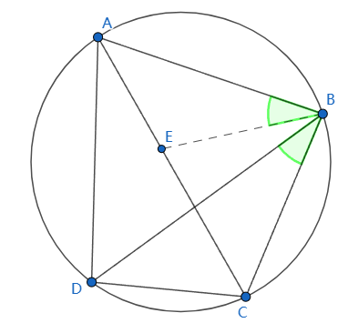

# 托勒密定理 Ptolemy's Theorem

[返回目录](index.md)

圆的内接四边形，对边之积的和于对角线之积相等。

如图

A, B, C, D四点共圆，则 $\vert AC \vert \cdot \vert BD \vert = \vert AB \vert \cdot \vert CD \vert + \vert BC \vert \cdot \vert DA \vert$

【证明】

过B点作BE于AC相交于E点，使$\angle ABE = \angle DBC$.

又 $\because \angle CDB = \angle CAB$

$\therefore \triangle BAE \sim \triangle BDC$

$\therefore \dfrac{\vert AE \vert}{\vert AB \vert} = \dfrac{\vert DC \vert}{\vert DB \vert}$

$\therefore \vert AE \vert \cdot \vert DB \vert = \vert AB \vert \cdot \vert DC \vert$

$\because \angle ABD = \angle ABE + \angle EBD = \angle DBC + \angle EBC=\angle EBC$

且 $\angle ADB = \angle ECB$

$\therefore \triangle ADB \sim \triangle ECB$

$\therefore \dfrac{\vert EC \vert}{\vert CB \vert} = \dfrac{\vert AD \vert}{\vert DB \vert}$

$\therefore \vert EC \vert \cdot \vert DB \vert = \vert CB \vert \cdot \vert AD \vert$

$\therefore \vert AE \vert \cdot \vert DB \vert + \vert EC \vert \cdot \vert DB \vert = \vert AB \vert \cdot \vert DC \vert + \vert CB \vert \cdot \vert AD \vert$

$\therefore (\vert AE \vert + \vert EC \vert ) \cdot \vert DB \vert = \vert AB \vert \cdot \vert DC \vert + \vert CB \vert \cdot \vert AD \vert$

$\therefore \vert AC \vert \cdot \vert DB \vert = \vert AB \vert \cdot \vert DC \vert + \vert CB \vert \cdot \vert AD \vert$

即 $\vert AC \vert \cdot \vert BD \vert = \vert AB \vert \cdot \vert CD \vert + \vert BC \vert \cdot \vert DA \vert$

【后记】

上周六(2023.07.22)[Charles](https://charlestsaur.github.io/)重新发现了这个定理，但没有证明出来，我尝试用余弦定理证明，但计算量非常大，放弃。本文的证明过程是从[维基百科的相关词条](https://zh.wikipedia.org/zh-hans/%E6%89%98%E5%8B%92%E5%AF%86%E5%AE%9A%E7%90%86)学到的。还有其他很多证明方法，比如使用正弦定理、余弦定理、复数等工具，将来有时间再补上。

