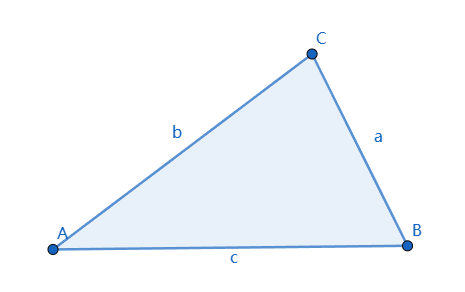
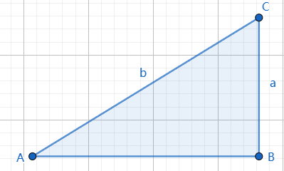
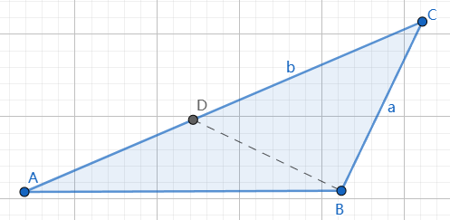
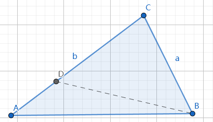

# 大边对大角，大角对大边

[返回目录](index.md)

三角形的边的大小顺序和角的大小顺序是一致的。

在$\triangle ABC$中，如果 $a \geq b \geq c$ 则 $\angle A \geq \angle B \geq \angle C$，反之亦然。

这个命题很直观，很简单，很实用，它可以用[正弦定理](law_of_sines.md)证明。

## 证明

### 1. 大角对大边

不妨通过比较$\angle A$和$\angle B$来说明，假设$\angle A \leq \angle B$

【第一种情形】

当$\angle A$和$\angle B$都是锐角

根据正弦定理

$\dfrac{a}{\sin A}=\dfrac{b}{sin B}$

$\therefore \dfrac{a}{b} = \dfrac{\sin A}{\sin B}$

又 $\because \sin x$在$[0, \dfrac{\pi}{2}]$是单调递增的

$\therefore a \leq b$

【第二种情形】

当$\angle A$是锐角，$\angle B$是直角。

直角边小于斜边，所以$a \lt b$

【第三种情形】

当$\angle A$是锐角，$\angle B$是钝角。

过B点作BC的垂线DB

$\vert BC \vert \lt \vert DC \vert \lt \vert AC \vert$

即得 $a \lt b$

综上三种情况，大角对大边得证。

### 2. 大边对大角

不妨通过比较a和b来说明，当$a=b$时，$\angle A = \angle B$.

下面讨论$a \neq b$的情形，假设$a \lt b$

无论是锐角直角还是钝角三角形，都可以用下面的证明。

在长边CA上作线段CD，使$\vert CD \vert = \vert CB \vert = a$

$\therefore \angle ABC \gt \angle DBC = \angle BDC \gt \angle A$

即得 $\angle A \lt \angle B$