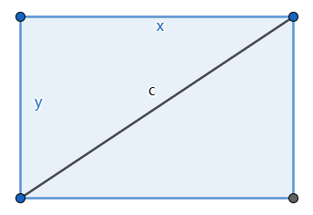

# 面积最大的矩形

[返回目录](index.md)

昨天(2023.07.15)和[Charles](https://charlestsaur.github.io/)讨论课本上介绍长度单位的文章，其中提到了英寸(inch)。我们想到电子产品的屏幕是按英寸来算的，但是屏幕的长宽比有4:3, 16:9等等不同的比例，那同样是23英寸的屏幕，长宽比不同，面积相同吗？

我们进一步讨论了这个问题，并把问题抽象为：如果一个矩形的对角线是一定的，那这个矩形在怎样的情形下面积最大？

根据矩形的面积公式，矩形的面积为长宽之积，所以，我们把问题进一步明确化：**如果一个矩形的对角线是一定的，那这个矩形的长和宽比例为多少时，矩形面积最大？**

这时我们已经画了一些图，隐隐约约感觉可能是长宽相等，即矩形为正方形时，面积最大，但我们此时还不能证明。

然后我们各自思考演算，找到了矩形面积最大的条件。

## 1. Charles的证明

如图所示，将原矩形ABCD向两个长宽两个方向延长一倍成一个更大的矩形AEFG. B, I, H, D是大矩形AEFG所在边的中点。

四个中点的连线在大矩形中构成了一个边长为c的菱形，同时也把大矩形分割成八个全等的三角形。

矩形ABCD的面积 $S_{ABCD}$ 为两个小三角形的面积之和。

菱形BIHD的面积 $S_{BIHD}$ 为四个小三角形面积之和。

所以 $S_{ABCD}=\dfrac{S_{BIHD}}{2}$

假设菱形BIHD的高BJ为h，则 $S_{BIHD}=ch$

h越接近c，$S_{BIHD}$ 越大。当h=c时，$S_{BIHD}$ 最大，此时菱形为正方形，此时 BC=CB，即矩形ABCD为正方形。

## 2. 我的证明

如图所示，不妨设矩形相邻两条边为x和y，对角线为定长c。

则 $x^2+y^2=c^2$

矩形的面积 $S=xy$

为了简化问题，不妨设 $c=1$

则 $x^2+y^2=1$

假设 $x=\sin{\theta}, y=\cos{\theta}$

则 $S=xy=\sin{\theta}\cos{\theta}=\dfrac{\sin{2\theta}}{2}$

显然 $\theta = \dfrac{\pi}{4}$时，$S_{max}=\dfrac{1}{2}$

此时 

$x=\sin{\theta}=\sin{\dfrac{\pi}{4}}=\dfrac{\sqrt{2}}{2}$

$y=\cos{\theta}=\cos{\dfrac{\pi}{4}}=\dfrac{\sqrt{2}}{2}$

所以 $x=y$

即：矩形为正方形时，面积最大。

点评：以上推导过程虽然是正确的，但用到了三角函数的知识，需要中学的知识，Charles还无法完全理解。

### 不用三角函数

如果不用三角函数，则 $S=xy=x\sqrt{1-x^2}$

问题就转化为求曲线$x\sqrt{1-x^2}$的极值，这个其实还比较困难，但可以通过用GeoG作图大概感受下：

---

后记：一开始，[Charles](https://charlestsaur.github.io/)还误以为虽然长宽比不一样，但长宽的和是一样，他还误打误撞提了一个猜想——[两数之积不大于两数之和一半的平方](product_bound_halfsum_square.md)，经过我的证明，是正确的。

