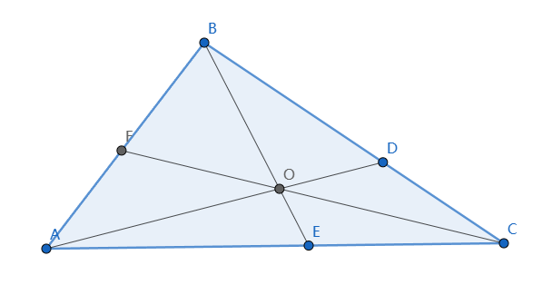

# Ceva 定理

[返回目录](index.md)

如上图，O是$\triangle ABC$中任意一点，直线AO, BO, CO分别和三角形的边相交于D, E, F, 则
$\dfrac{\vert AF \vert}{\vert FB \vert} \cdot \dfrac{\vert BD \vert}{\vert DC \vert} \cdot \dfrac{\vert CE \vert}{\vert EA \vert} = 1$

据[维基百科资料](https://en.wikipedia.org/wiki/Ceva%27s_theorem)，这个定理是Giovanni Ceva在1678发表的，昨天(2023.07.21)被Charles重新发现了一次。

> The theorem is often attributed to Giovanni Ceva, who published it in his 1678 work De lineis rectis. But it was proven much earlier by Yusuf Al-Mu'taman ibn Hűd, an eleventh-century king of Zaragoza.

## 证明

根据[燕尾模型](yanwei.md)，

$\dfrac{\vert AF \vert}{\vert FB \vert} = \dfrac{S_{\triangle OAC}}{S_{\triangle OBC}}$,
$\dfrac{\vert BD \vert}{\vert DC \vert} = \dfrac{S_{\triangle OAB}}{S_{\triangle OAC}}$,
$\dfrac{\vert CE \vert}{\vert CA \vert} = \dfrac{S_{\triangle OBC}}{S_{\triangle OAB}}$

$\therefore \dfrac{\vert AF \vert}{\vert FB \vert} \cdot \dfrac{\vert BD \vert}{\vert DC \vert} \cdot \dfrac{\vert CE \vert}{\vert EA \vert} = \dfrac{S_{\triangle OAC}}{S_{\triangle OBC}} \cdot \dfrac{S_{\triangle OAB}}{S_{\triangle OAC}} \cdot \dfrac{S_{\triangle OBC}}{S_{\triangle OAB}}= 1$

## 点评

这个定理看起来很整齐，结论也很简单，但发现过程却不容易。