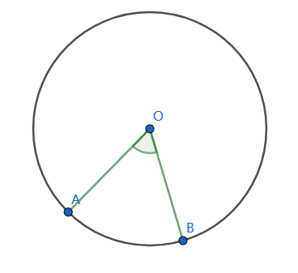
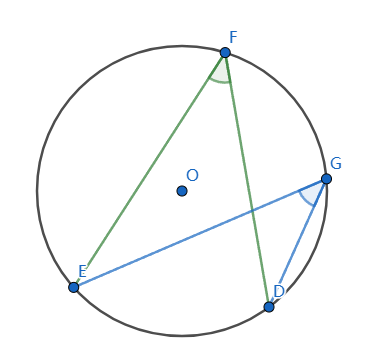
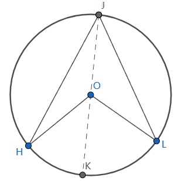
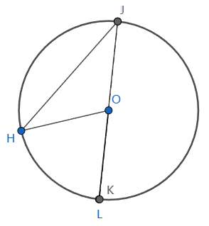
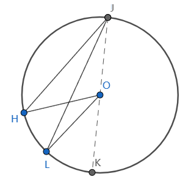

# 圆周角和圆心角

[返回目录](index.md)

这是初中平面几何里的基础内容，最近Charles聊到相关的问题，记录一下。

## 1. 圆心角 Radius Angle

顶点在圆心，两边和圆周相交的角。

如上图, $\angle AOB$是圆O的一个圆心角，对应的弧是$\overset{\large\frown}{AB}$.

圆心角可以用对应的单位圆的弧长来表示，单位圆的圆周是$2\pi$，所以用弧长度量角的大小时，设置360$^\circ=2\pi$ rad(弧度)，弧长为半径的弧对应圆心角为1.

弧长相等的弧所对的圆心角是相等的，这也是用单位圆弧长来度量角的原因。

## 2. 圆周角 Angle of Circumference

顶点在圆周，两边和圆周相交的角。

如上图$\angle EFD$和$\angle EGD$都是$\overset{\large \frown}{ED}$所对的圆周角。$\angle FEG$和$\angle FDG$也是圆周角。

一条弧有可以对应无数圆周角，它们都相等吗？且看下面的内容。

## 3. 圆心角和圆周角的一些性质

如上图，$\overset{\large \frown}{HL}$所对的圆心角和圆周角分别是$\angle HOL$和$\angle HJK$.

$\triangle HOJ$和$\triangle LOJ$是两个以半径为腰的等腰三角形

$\therefore \angle OHJ = \angle OJH$, $\angle OLJ = \angle OJL$

$\therefore \angle HOL = \angle HOK + \angle KOL = 2\angle OJH + 2\angle OJL=2(\angle OJH + \angle OJL)=2\angle HJL$

在上图中，**同弧所对的圆心角是圆周角的两倍**。再考察另外两种情形：

顺时针转动L，使K和L重合：

继续顺时针转动L，使K和L在JK的同一侧：

很容易看出，同弧所对的圆心角还是圆周角的两倍。

同一段弧，对应无数圆周角，和同一个圆心角，这些圆周角都等于圆心角的一半，所以**同弧所对的圆周角都相等**。

直径对应的圆周是半圆，对应的圆心角是$\pi$，所以直径所对的圆周角是$\dfrac{\pi}{2}$，即**直径所对的圆周角是直角**。