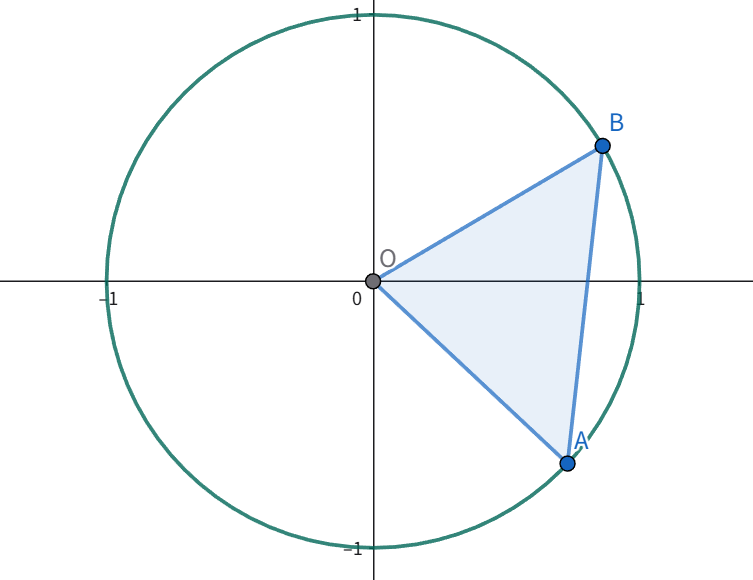

# 证明 $\cos(\alpha - \beta)=\cos(\alpha)\cos(\beta)+\sin(\alpha)\sin(\beta)$

[Index](index.md)

2026.01.09

> 这个公式最早是高中学到的，然后未经严格证明就懵懵懂懂在用了，现在我来把证明补上。如果把人生比作爬山，我已经在走下山的路了，等我死的时候，连这么简单的问题都没真的搞懂过，就太遗憾了。

-【已知】：$\alpha, \beta \in \mathbb{R}$
-【求证】：$\cos(\alpha - \beta)=\cos(\alpha)\cos(\beta)+\sin(\alpha)\sin(\beta)$

## 证明

单位圆上，任意角度 $\theta$ 对应的点坐标是 $(\cos(\theta), \sin(\theta))$.

现在我们在单位圆上任取两点：

- 点 $A$ 对应的角度为 $\alpha$，坐标为 $(\cos(\alpha), \sin(\alpha))$
- 点 $B$ 对应的角度为 $\beta$，坐标为 $(\cos(\beta), \sin(\beta))$

根据平面坐标系中的两点的距离公式，可知：

$\vert AB\vert ^2 = (cos(\alpha) - \cos(\beta))^2 + (\sin(\alpha) - \sin(\beta))^2$

展开并利用公式 $\sin^2(\theta) + \cos^2(\theta) = 1$ 得：

$\vert AB\vert ^2 = 2 - 2(\cos(\alpha)\cos(\beta)+\sin(\alpha)\sin(\beta))$

又根据[余弦定理](law_of_cosines.md)，在 $\triangle{OAB}$ 中（$\vert OA\vert =\vert OB\vert =1$，$\overrightarrow{OA}$ 和 $\overrightarrow{OB}$ 的夹角为 $\vert \alpha - \beta\vert $）：

$\vert AB\vert ^2 = \vert OA\vert ^2 + \vert OB\vert ^2-2\vert OA\vert \vert OB\vert \cos(\alpha-\beta)=2-2\cos(\alpha-\beta)$

综上可得：$\cos(\alpha - \beta)=\cos(\alpha)\cos(\beta)+\sin(\alpha)\sin(\beta)$

证毕。

## 扩展说明

根据 $\cos(\alpha - \beta)=\cos(\alpha)\cos(\beta)+\sin(\alpha)\sin(\beta)$

以 $-\beta$ 代 $\beta$，可得 $\cos(\alpha + \beta)=\cos(\alpha)\cos(\beta)-\sin(\alpha)\sin(\beta)$

以 $\dfrac{\pi}{2} - \alpha$ 代 $\alpha$，可得：

$\cos(\dfrac{\pi}{2} - \alpha - \beta)=\cos(\dfrac{\pi}{2} - \alpha)\cos(\beta)+\sin(\dfrac{\pi}{2} - \alpha)\sin(\beta)$

- 左边：$\cos(\dfrac{\pi}{2} - \alpha - \beta)=\cos(\dfrac{\pi}{2} - (\alpha + \beta)) = \sin(\alpha + \beta)$
- 右边可以化作：$\sin(\alpha)\cos(\beta)+\cos(\alpha)\sin(\beta)$

即得到正弦的和角公式：$\sin(\alpha + \beta)=\sin(\alpha)\cos(\beta)+\cos(\alpha)\sin(\beta)$

再以 $-\beta$ 代 $\beta$ 代入上式，可得：$\sin(\alpha - \beta)=\sin(\alpha)\cos(\beta)-\cos(\alpha)\sin(\beta)$

这里我们只证明了一个公式就得到了另外三个，实际上这四个公式可以认为是等价的，只要其中一个成立，另外三个都成立。下面再整齐地列出这四个公式：

- $\cos(\alpha - \beta)=\cos(\alpha)\cos(\beta) + \sin(\alpha)\sin(\beta)$
- $\cos(\alpha + \beta)=\cos(\alpha)\cos(\beta) - \sin(\alpha)\sin(\beta)$
- $\sin(\alpha + \beta)=\sin(\alpha)\cos(\beta) + \cos(\alpha)\sin(\beta)$
- $\sin(\alpha - \beta)=\sin(\alpha)\cos(\beta) - \cos(\alpha)\sin(\beta)$

还可以继续扩展成其他三角公式，可以参本站记录的[三角函数公式 Trigonometric Formulas](trigonometric_formulas.md)。

