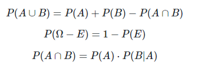

# How to Display Math Formulas in GitHub Pages

[返回目录](index.md)

If you have encountered a problem where the math formulas do not display when your site is published, despite being visible while editing in markdown, you can follow these steps to fix it.

First, input the following math formulas in plaintext:

```plaintext
$$ P(A\cup B)=P(A)+P(B)-P(A\cap B) $$

$$ P(\Omega -E)=1-P(E) $$

$$ P(A\cap B)=P(A)\cdot P(B\vert A) $$
```

You expect to see the formulas as shown below:



However, you may see some unintelligible text:

```plaintex
\[P(A\cup B)=P(A)+P(B)-P(A\cap B)\] \[P(\Omega -E)=1-P(E)\] \[P(A\cap B)=P(A)\cdot P(B\vert A)\]
```

## Solution

To resolve this issue, add the following script to the head of the markdown, following the instructions on <https://docs.mathjax.org/en/latest/web/start.html>:

```html
<script>
MathJax = {
  tex: {
    inlineMath: [['$', '$'], ['\\(', '\\)']]
  }
};
</script>
<script id="MathJax-script" async
  src="https://cdn.jsdelivr.net/npm/mathjax@3/es5/tex-chtml.js">
</script>
```

---

This version is edited by ChatGPT. It's better than [my original version](https://github.com/iridiumcao/iridiumcao.github.io/commit/75f59bc941e08461394d8bb701542f83f52cb9b6).