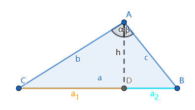
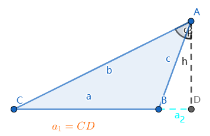

# Law of Cosines 余弦定理

[返回目录](index.md)

> 本文中的证法二更简单好懂一些，可以直接跳过证法一先看证法二。

**已知**：$\triangle{ABC}$中, $\angle{A}$, $\angle{B}$, $\angle{C}$对应的三条边分别是a, b, c

**求证**：

* $a^2 = b^2 + c^2 -2bc\cos{\angle A}$
* $b^2 = a^2 + c^2 -2ac\cos{\angle B}$
* $c^2 = a^2 + b^2 -2ab\cos{\angle C}$

## 证法一

> 这个证明会用到了三角公式$\cos{\angle A}=\cos(\alpha + \beta)=\cos\alpha\cos\beta - \sin\alpha\sin\beta$，实际上也可以不用这个公式，只用勾股定理和诱导公式就行，参本文证法二。

**分析**：

设有一三角形如图所示

$AD \perp BC$，AD是BC上的高, 记为h.

由勾股定理可得：

$b^2=a_1^2+h^2, c^2=a_2^2+h^2$

$\therefore b^2+c^2=a_1^2+a_2^2+2h^2$

$\because a^2 = (a_1 + a_2)^2 = a_1^2+a_2^2+2a_1a_2$

$\therefore b^2+c^2-a^2=2(h^2-a_1a_2)$ 式(1)

欲证 $a^2 = b^2 + c^2 -2bc\cos{\angle A}$

即证 $b^2+c^2-a^2=2bc\cos{\angle A}$ 式(2)

如果式(1)式(2)两式右边相等即得证

即证 $bc\cos{\angle A}=h^2-a_1a_2$

即证 $\cos{\angle A}=\dfrac{h^2-a_1a_2}{bc}$ 式(3)

下面尝试计算 $\cos{\angle A}$

$\cos{\angle A}=\cos(\alpha + \beta)=\cos\alpha\cos\beta - \sin\alpha\sin\beta\
               =\dfrac{h}{b}\cdot\dfrac{h}{c} - \dfrac{a_1}{b}\cdot\dfrac{a_2}{c}\
               =\dfrac{h^2-a_1a_2}{bc}$

式(3)得证，所以 $a^2 = b^2 + c^2 -2bc\cos{\angle A}$ 成立，同理可证另外两式。

以上分析过程本身也可以作为证明过程，但也可以整理为更简单的证明形式，如下：

**证明**：

$\because \cos{\angle A}=...=\dfrac{h^2-a_1a_2}{bc}$

$\therefore b^2 + c^2 -2bc\cos{\angle A}\
=b^2+c^2-2(h^2-a_1a_2)\
=(a_1^2+h^2) + (a_2^2+h^2) - 2(h^2-a_1a_2)\
=a_1^2+a_2^2+2a_1a_2\
=(a_1+a_2)^2\
=a^2$

当$\angle{A} \geq \dfrac{\pi}{2}$可以用上面的证明，而当$\angle{A}$为锐角时，即$\angle{A} \lt \dfrac{\pi}{2}$时，则需要下面的证明过程：

由图可知：$a=a_1-a_2$, $\angle{A}=\alpha - \beta$

$\therefore b^2 + c^2 -2bc\cos{\angle A}=b^2 + c^2 -2bc\cos{(\alpha - \beta)}\
=b^2 + c^2 - 2bc(\cos\alpha\cos\beta+\sin\alpha\sin\beta)\
=b^2 + c^2 - 2bc(\dfrac{h}{b}\cdot\dfrac{h}{c} + \dfrac{a_1}{b}\cdot\dfrac{a_2}{c})\
=(a_1^2+h^2) + (a_2^2 + h^2) - 2bc\cdot\dfrac{h^2+a_1a_2}{bc}$

$=...\
=(a_1-a_2)^2\
=a^2$

综上，$a^2 = b^2 + c^2 -2bc\cos{\angle A}$得证，另外两种情况类似可证。

## 证法二

> 本证法以 $\angle B$ 为例，其余情况类似。

### 1. 当 $\angle{B}$ 为锐角时

继续使用前一个证法里的图，设有一三角形如图所示

$AD \perp BC$，AD是BC上的高, 记为h.

则依据勾股定理 $b^2 = h^2 + {a_1}^2$

又 $h=c\sin{\angle B}, a_1 = a - a_2 = a - c\cos{\angle B}$

$\therefore b^2 = c^2\sin^2\angle{B} + (a - c\cos{\angle B})^2$

$\therefore b^2 = c^2\sin^2\angle{B} + a^2 - 2ac\cos{\angle B}+c^2\cos^2\angle{B}$

代入 $\sin^2\angle{B} + \cos^2\angle{B} = 1$ 得：

$\therefore b^2 = a^2 + c^2 - 2ac\cos{\angle B}$

### 2. 当 $\angle{B}$ 为直角时

此时根据勾股定理，可得：

$b^2 = a^2 + c^2$

此时 $\cos\angle{B} = \cos(\dfrac{\pi}{2}) = 0$

$\therefore b^2 = a^2 + c^2 = a^2 + c^2 + 2ac\cos(\angle{B})$

### 3. 当 $\angle{B}$ 为钝角时

继续使用前一个证法里的图，设有一三角形如图所示

$AD \perp BC$，AD是BC上的高, 记为h. $D$ 在 $CB$ 的延长线上。

则依据勾股定理 $b^2 = h^2 + {(a + a_2)}^2$

又 

- $h=c\sin{(\pi - \angle{B})}=c\sin\angle{B}$
- $a_2 = c\cos{(\pi - \angle{B})=-c\cos\angle{B}}$

$\therefore b^2 = c^2\sin^2\angle{B} + (a - c\cos\angle B)^2$

展开并代入 $\sin^2\angle{B} + \cos^2\angle{B} = 1$ 得：

$\therefore b^2 = a^2 + c^2 - 2ac\cos{\angle B}$

> 这个网站也有一个[证明](https://www.mathopenref.com/lawofcosinesproof.html)，它只证了相当于我这里的第一种情况，要简单一些。

