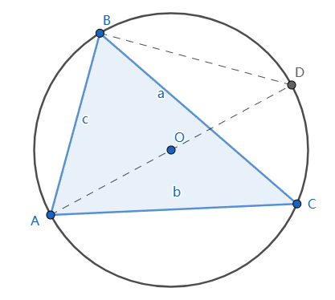

# 正弦定理 Law of Sines

[返回目录](index.md)

设$\triangle ABC$的三个角$\angle A$, $\angle B$和$\angle C$对应的三条边是a, b和c, R是三角形的外接圆的半径，则

$\dfrac{a}{\sin A} = \dfrac{b}{\sin B} = \dfrac{c}{\sin C} = 2R$

## 证明

如下图，直线AO过圆心O交圆周于D，

根据[圆周角的性质](circumference_and_radius_angle.md)，

$\angle ACB = \angle ADB$, $\angle ABD = \dfrac{\pi}{2}$

$\therefore \vert AB \vert = \vert AD \vert \sin{\angle ADB}=\vert AD \vert \sin{\angle ACB}=2R\sin{\angle ACB}$

即 $c=2R\sin{C}$

$\therefore \dfrac{c}{\sin C} = 2R$

同理可证

$\therefore \dfrac{a}{\sin A} = 2R$

$\therefore \dfrac{b}{\sin B} = 2R$

$\therefore \dfrac{a}{\sin A} = \dfrac{b}{\sin B} = \dfrac{c}{\sin C} = 2R$

---

参考

* [Law of Sines, Wikipedia](https://en.wikipedia.org/wiki/Law_of_sines)

