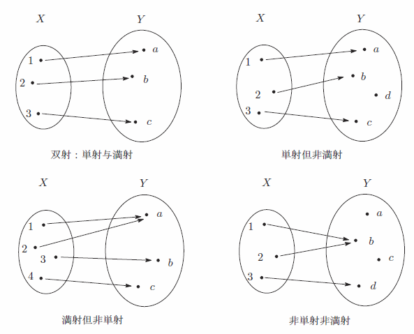

# 集合映射之单射满射双射

本文没有具体的数学公式和定义。

【单射 injection】如果集合A对B是单射关系，则对A中的任意一个元素，在B中都有唯一的一个元素与之对应。

【满射 surjection】如果集合A对B是满射关系，则B中的任意一个元素，都是A中某个元素的象。

【双射 bijection】如果集合A对B即是单射又是满射，则为双射。

参看从[维基百科](https://zh.wikipedia.org/wiki/%E5%8D%95%E5%B0%84%E3%80%81%E6%BB%A1%E5%B0%84%E4%B8%8E%E5%8F%8C%E5%B0%84)下载的截图：

