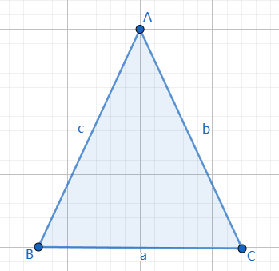

# 三角形等边对等角

[返回目录](index.md)

等腰三角形两腰所对的角相等。

如下图，已知$\triangle ABC$的两边AB=AC，则$\angle B = \angle C$.

## 证明一

将$\triangle ABC$和$\triangle ACB$视为不同的三角形，利用全等三角形的性质证明$\angle B = \angle C$，详细证明过程如下。

$\because AB = AC, \angle BAC = \angle CAB, AC = AB$

根据SAS判定规则，$\triangle BAC \simeq \triangle CAB$

$\therefore \angle ABC = \angle ACB$

即 $\angle B = \angle C$

证毕。

## 证明二

$S_{\triangle} = \dfrac{ab \sin C}{2} = \dfrac{ac \sin B}{2}$

$\therefore b \sin C = c \sin B$

$\because b = c$

$\therefore \sin C = \sin B$

$\because B \gt 0, C \gt 0 \lt B + C \lt \pi$

$\therefore B = C$

证毕。

## 证明三

用反证法试试。

假如 $\angle B \neq \angle C$

$\because B \gt 0, C \gt 0 \lt B + C \lt \pi$

$\therefore \sin C \neq \sin B$

$\because b = c$

$\therefore b \sin C \neq c \sin B$

$\therefore \dfrac{ab \sin C}{2} \neq \dfrac{ac \sin B}{2}$

但 $S_{\triangle} = \dfrac{ab \sin C}{2}$ 且 $S_{\triangle} = \dfrac{ac \sin B}{2}$

$\therefore S_{\triangle} \neq S_{\triangle}$ 这个结论显然错误

$\therefore$ 假设不成立

$\therefore \angle B = \angle C$
