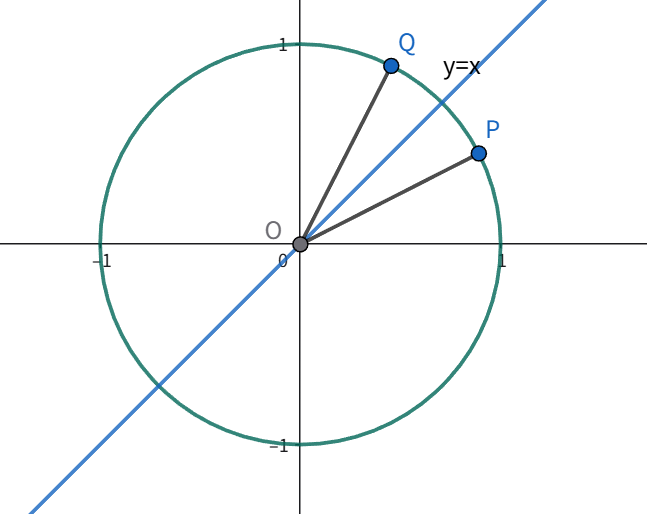

# 证明 $\sin(\theta) = \cos(\dfrac{\pi}{2} - \theta)$

[Index](index.md)

2026.01.08

很久很久以前，还是我在上高中的时候，这个公式用得飞起，但当时其实只证明了 $\theta$ 为锐角的情况。当时可能也没动手证明，而是相信教材不会错。但多年后，我再次碰到三角函数，再次意识到自己还在使用未经证明的公式，这简直让人头疼。本文就是为了解决这一长期的遗憾，应该有快三十年了吧。

## 问题

- 【已知】：$\theta \in \mathbb{R}$
- 【求证】：$\sin(\theta) = \cos(\dfrac{\pi}{2} - \theta)$

## 说明

考虑到三角函数的周期性：

$$
\sin(\theta) = \sin(\theta + 2k\pi), k \in \mathbb{Z} \\
\cos(\theta) = \cos(\theta + 2k\pi), k \in \mathbb{Z}
$$

只要证明 $\theta \in [0, 2\pi)$ 公式成立即可。即使无需考虑限定范围，但不妨在 $\theta \in [0, 2\pi)$ 这个范围中去理解，这样能大大简化问题。

## 证明

> 注：本证明过程已经天然包含了所有实数，严格证明并不依赖 $\theta \in [0, 2\pi)$，但在此区间内几何直观最清晰。

设 $\theta$ 在单位圆上对应的点的坐标是 $P(\cos(\theta), \sin(\theta))$

在平面直角坐标系中，关于直线 $y=x$ 对称的两个点，其横纵坐标会互换。

设 $P$ 相对于 $y=x$ 的对称点是 $Q$，则 $Q$ 的坐标为 $(\sin(\theta), \cos(\theta))$，很明显 $Q$ 也在单位圆上。

注意到直线 $y=x$ 与 $x$ 轴的夹角为 $\dfrac{\pi}{4}$，假设 $\theta'$ 是 $OQ$ 与 $Ox$ 轴正方向的夹角，

则 $\theta$ 和 $\theta'$ 关于 $\dfrac{\pi}{4}$ 对称 (对应于 $Q$ 和 $Q'$ 关于直线 $y=x$ 对称)

所以 $\dfrac{\theta + \theta'}{2}=\dfrac{\pi}{4}$

所以 $\theta' = \dfrac{\pi}{2} - \theta$

所以 $\theta'$ 上 $Q$ 点的坐标还可以表示成 $(\cos(\theta'), \sin(\theta'))$，即 $(\cos(\dfrac{\pi}{2} - \theta), \sin(\dfrac{\pi}{2} - \theta))$

所以

- $\cos (\theta) = \sin(\dfrac{\pi}{2} - \theta)$
- $\sin (\theta) = \cos(\dfrac{\pi}{2} - \theta)$

证毕。

## 扩展说明

依据上面的证明，很容易得出其他诱导公式(Cofunction Identities, Induction Formula)：

- $\tan(\theta) = \dfrac{\sin(\theta)}{\cos(\theta)} = \dfrac{\cos(\dfrac{\pi}{2} - \theta)}{\sin(\dfrac{\pi}{2} - \theta)}= \cot(\dfrac{\pi}{2} - \theta)$
- $\cot(\theta) = \dfrac{\cos(\theta)}{\sin(\theta)} = \dfrac{\sin(\dfrac{\pi}{2} - \theta)}{\cos(\dfrac{\pi}{2} - \theta)}= \tan(\dfrac{\pi}{2} - \theta)$
- $\sec(\theta) = \dfrac{1}{\cos(\theta)} = \dfrac{1}{\sin(\dfrac{\pi}{2} - \theta)} = \csc(\dfrac{\pi}{2} - \theta)$
- $\csc(\theta) = \dfrac{1}{\sin(\theta)} = \dfrac{1}{\cos(\dfrac{\pi}{2} - \theta)} = \sec(\dfrac{\pi}{2} - \theta)$

上述等式在分母不为零的前提下成立。

