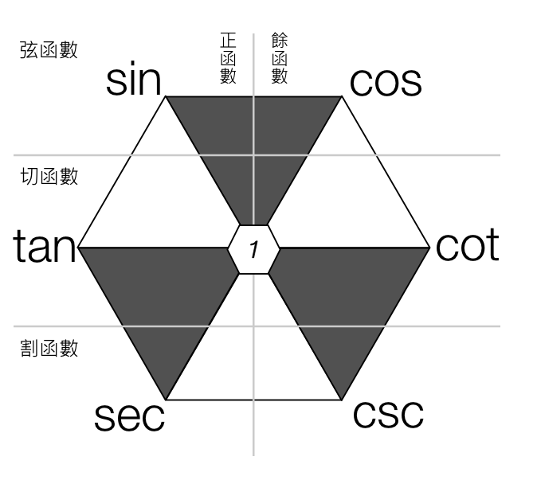
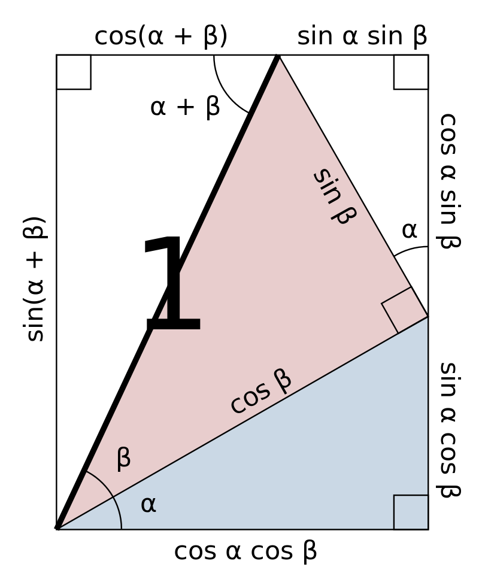
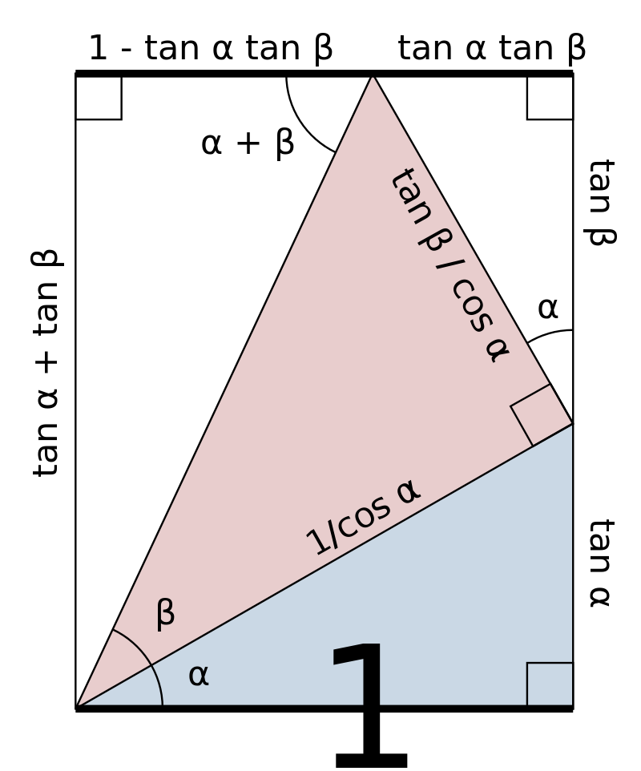

# 三角公式

[返回目录](index.md)

## 0. 常见的特殊角的三角函数值

|   | $0$ | $\frac{1}{6}\pi$ | $\frac{1}{4}\pi$ | $\frac{1}{3}\pi$ | $\frac{1}{2}\pi$ | $1\pi$ | $\frac{3}{2}\pi$ |
| --- | --- | --- | --- | --- | --- | --- | --- |
| $\sin$ | $0$ | $\frac{1}{2}$ | $\frac{\sqrt{2}}{2}$ | $\frac{\sqrt{3}}{2}$ | $1$ | $0$ | $-1$ |
| $\cos$ | $1$ | $\frac{\sqrt{3}}{2}$ | $\frac{\sqrt{2}}{2}$ | $\frac{1}{2}$ | $0$ | $-1$ | $0$ |
| $\tan$ | $0$ | $\frac{\sqrt{3}}{3}$ | $1$ | $\sqrt{3}$ | undefined | $0$ | undefined |
| $\cot$ | undefined | $\sqrt{3}$ | $1$ | $\frac{\sqrt{3}}{3}$ | $0$ | undefined | $0$ |
| $\sec$ | $1$ | $\frac{2\sqrt{3}}{3}$ | $\sqrt{2}$ | $2$ | undefined | $-1$ | undefined |
| $\csc$ | undefined | $2$ | $\sqrt{2}$ | $\frac{2\sqrt{3}}{3}$ | $1$ | undefined | $-1$ |

## 1. 诱导公式 Induction Formula

### 1.1 反射

### 1.2 位移和周期

## 2. 六边形

倒数关系

* $\sin\alpha \csc\alpha = 1$
* $\cos\alpha \sec\alpha = 1$
* $\tan\alpha \cot\alpha = 1$

平方和关系

* $\sin^2\alpha + \cos^2\alpha = 1$ (毕达哥拉斯三角恒等式)
* $\tan^2\alpha + 1 = \sec^2\alpha$
* $1 + \cot^2\alpha = \csc^2\alpha$

相邻三个值的关系（当前值等于往右第一个值除以往右第二个值，当前值等于相邻两个值的积）

* $\tan\alpha = \dfrac{\sin\alpha}{\cos\alpha} \iff \sin\alpha = \tan\alpha \cos\alpha$
* $\sin\alpha = \dfrac{\cos\alpha}{\cot\alpha} \iff \cos\alpha = \sin\alpha \cot\alpha$
* $\cos\alpha = \dfrac{\cot\alpha}{\csc\alpha} \iff \cot\alpha = \cos\alpha \csc\alpha$
* $\cot\alpha = \dfrac{\csc\alpha}{\sec\alpha} \iff \csc\alpha = \cot\alpha \sec\alpha$
* $\csc\alpha = \dfrac{\sec\alpha}{\tan\alpha} \iff \sec\alpha = \csc\alpha \tan\alpha$
* $\sec\alpha = \dfrac{\tan\alpha}{\sin\alpha} \iff \tan\alpha = \sec\alpha \sin\alpha$

## 3. 和差恒等式

这里的两个图形证明非常不错，想当年我的老师可能也是不晓得的。时间飞快，这一晚，就是二十多年。

* 正弦 $\sin(\alpha \pm \beta )=\sin \alpha \cos \beta \pm \cos \alpha \sin \beta$
* 余弦 $\cos(\alpha \pm \beta )=\cos \alpha \cos \beta \mp \sin \alpha \sin \beta$
* 正切 $\tan(\alpha \pm \beta )={\dfrac  {\tan \alpha \pm \tan \beta }{1\mp \tan \alpha \tan \beta}}$
* 余切 $\cot(\alpha \pm \beta )={\dfrac  {\cot \alpha \cot \beta \mp 1}{\cot \beta \pm \cot \alpha }}$
* 正割 $\sec(\alpha \pm \beta )={\dfrac  {\sec \alpha \sec \beta }{1\mp \tan \alpha \tan \beta }}$
* 余割 $\csc(\alpha \pm \beta )={\dfrac  {\csc \alpha \csc \beta }{\cot \beta \pm \cot \alpha }}$

二倍角公式

* $\sin(2\alpha) = 2 \sin \alpha \cos \alpha$
* $\cos(2\alpha) = \cos^2 \alpha - \sin^2 \alpha = 2\cos^2 \alpha - 1 = 1 - 2\sin^2 \alpha$
* $\tan(2\alpha) = \dfrac{2\tan \alpha}{1 - \tan^2 \alpha}$

三倍角公式

* $\sin(3\alpha) = 3 \sin \alpha - 4 \sin^3 \alpha$
* $\cos(3\alpha) = 4 \cos^3 \alpha - 3 \cos \alpha$

半角公式（降幂公式）

* $\sin^2{\dfrac{\theta}{2}} = \dfrac{1 - \cos \theta}{2} \Rightarrow \sin{\dfrac{\theta}{2}} = \plusmn \sqrt{\dfrac{1 - \cos \theta}{2}}$
* $\cos^2{\dfrac{\theta}{2}} = \dfrac{1 + \cos \theta}{2} \Rightarrow \cos{\dfrac{\theta}{2}} = \plusmn \sqrt{\dfrac{1 + \cos \theta}{2}}$
* $\tan^2{\dfrac{\theta}{2}} = \dfrac{1 - \cos \theta}{1 + \cos \theta} \Rightarrow \tan{\dfrac{\theta}{2}} = \plusmn \sqrt{\dfrac{1 - \cos \theta}{1 + \cos \theta}}$
* $\tan{\dfrac{\theta}{2}} = \dfrac{\sin \theta}{1+\cos \theta} = \dfrac{1 - \cos \theta}{\sin \theta}$(注意定义域的变化）

## 4. 和差化积 sum-to-product

## 5. 积化和差 product-to-sum

Ref: 
* [维基百科·三角恒等式](https://zh.wikipedia.org/wiki/%E4%B8%89%E8%A7%92%E6%81%92%E7%AD%89%E5%BC%8F)
* [List of trigonometric identities](https://en.wikipedia.org/wiki/List_of_trigonometric_identities) (Wikipedia)
* [三角公式](https://easymath-wiki.org/%E5%88%9D%E7%AD%89%E6%95%B0%E5%AD%A6/%E4%B8%89%E8%A7%92%E5%87%BD%E6%95%B0/02%E4%B8%89%E8%A7%92%E5%85%AC%E5%BC%8F/) (Easymath-wiki)