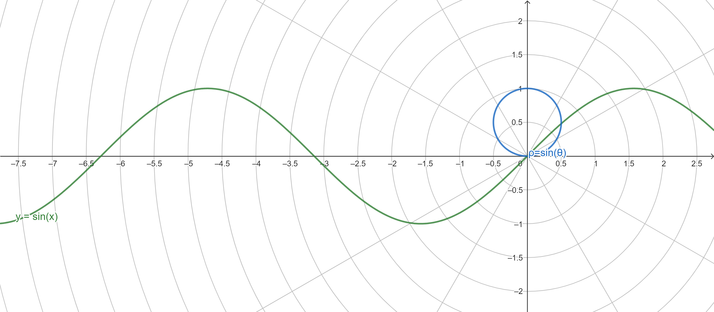
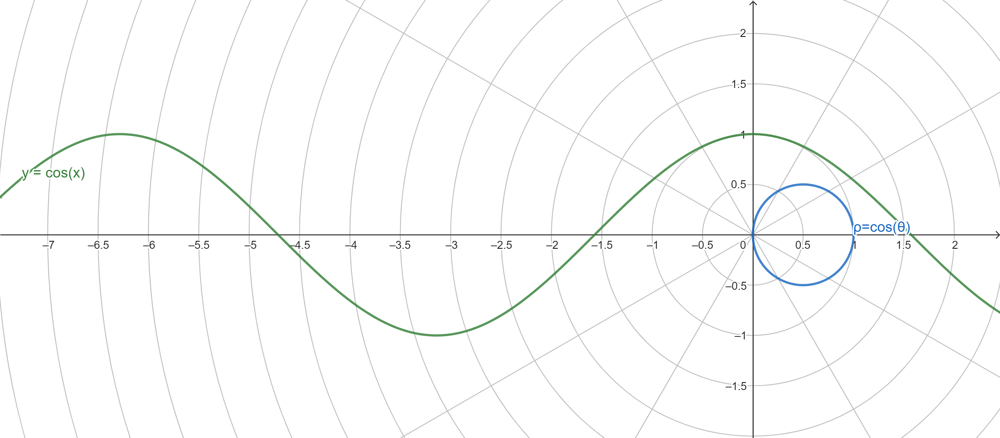
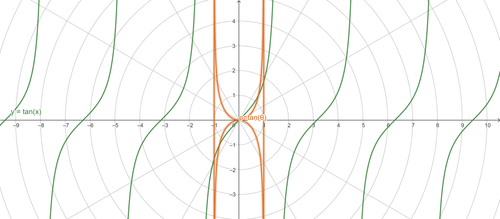
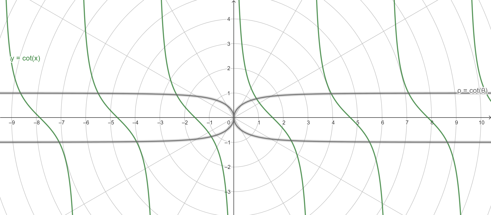
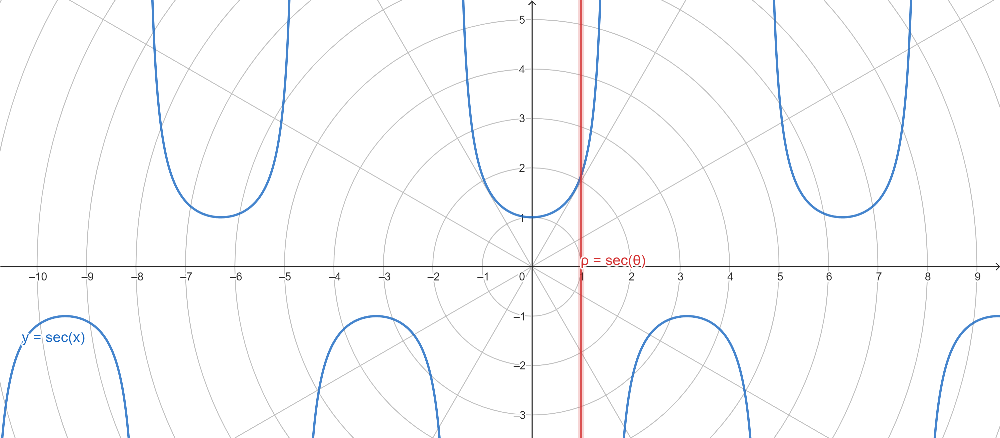
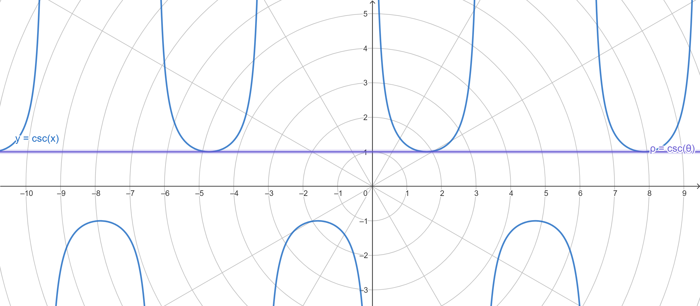

# 三角公式 Trigonometric Formulas

[返回目录](index.md)

- [三角公式 Trigonometric Formulas](#三角公式-trigonometric-formulas)
  - [1. 图像](#1-图像)
  - [2. 常见的特殊角的三角函数值](#2-常见的特殊角的三角函数值)
  - [3. 诱导公式 Induction Formula](#3-诱导公式-induction-formula)
    - [3.1 对称](#31-对称)
    - [3.2 位移和周期](#32-位移和周期)
  - [4. 六边形](#4-六边形)
  - [5. 和差恒等式](#5-和差恒等式)
  - [6. 积化和差 product-to-sum](#6-积化和差-product-to-sum)
  - [7. 和差化积 sum-to-product](#7-和差化积-sum-to-product)
  - [8. 万能公式](#8-万能公式)

## 1. 图像

基本三角函数在直角坐标和极坐标下的图像。

1. 正弦 sine

2. 余弦 cosine

3. 正切 tangent

4. 余切 cotangent

5. 正割 sec

6. 余割 csc

## 2. 常见的特殊角的三角函数值

|   | $0$ | $\frac{1}{6}\pi$ | $\frac{1}{4}\pi$ | $\frac{1}{3}\pi$ | $\frac{1}{2}\pi$ | $1\pi$ | $\frac{3}{2}\pi$ |
| --- | --- | --- | --- | --- | --- | --- | --- |
| $\sin$ | $0$ | $\frac{1}{2}$ | $\frac{\sqrt{2}}{2}$ | $\frac{\sqrt{3}}{2}$ | $1$ | $0$ | $-1$ |
| $\cos$ | $1$ | $\frac{\sqrt{3}}{2}$ | $\frac{\sqrt{2}}{2}$ | $\frac{1}{2}$ | $0$ | $-1$ | $0$ |
| $\tan$ | $0$ | $\frac{\sqrt{3}}{3}$ | $1$ | $\sqrt{3}$ | undefined | $0$ | undefined |
| $\cot$ | undefined | $\sqrt{3}$ | $1$ | $\frac{\sqrt{3}}{3}$ | $0$ | undefined | $0$ |
| $\sec$ | $1$ | $\frac{2\sqrt{3}}{3}$ | $\sqrt{2}$ | $2$ | undefined | $-1$ | undefined |
| $\csc$ | undefined | $2$ | $\sqrt{2}$ | $\frac{2\sqrt{3}}{3}$ | $1$ | undefined | $-1$ |

## 3. 诱导公式 Induction Formula

### 3.1 对称

| 反射于$\theta=0$（负角）        | 反射于$\theta=\dfrac{\pi}{4}$（余角）        | 反射于$\theta=\dfrac{\pi}{2}$（补角）| 反射于$\theta=\dfrac{3\pi}{4}$            |
|--------------------------------|--------------------------------------------|----------------------------------|----------------------------------------------|
| $\sin(0-\theta) = -\sin\theta$ | $\sin(\dfrac{\pi}{2}-\theta) = \cos\theta$ | $\sin(\pi-\theta) = \sin\theta$  | $\sin(\dfrac{3\pi}{2}-\theta) = -\cos\theta$ |
|  $\cos(0-\theta) = \cos\theta$ | $\cos(\dfrac{\pi}{2}-\theta) = \sin\theta$ | $\cos(\pi-\theta) = -\cos\theta$ | $\cos(\dfrac{3\pi}{2}-\theta) = -\sin\theta$ |
| $\tan(0-\theta) = -\tan\theta$ | $\tan(\dfrac{\pi}{2}-\theta) = \cot\theta$ | $\tan(\pi-\theta) = -\tan\theta$ | $\tan(\dfrac{3\pi}{2}-\theta) = \cot\theta$  |
| $\cot(0-\theta) = -\cot\theta$ | $\cot(\dfrac{\pi}{2}-\theta) = \tan\theta$ | $\cot(\pi-\theta) = -\cot\theta$ | $\cot(\dfrac{3\pi}{2}-\theta) = \tan\theta$  |
|  $\sec(0-\theta) = \sec\theta$ | $\sec(\dfrac{\pi}{2}-\theta) = \csc\theta$ | $\sec(\pi-\theta) = -\sec\theta$ | $\sec(\dfrac{3\pi}{2}-\theta) = -\csc\theta$ |
| $\csc(0-\theta) = -\csc\theta$ | $\csc(\dfrac{\pi}{2}-\theta) = \sec\theta$ | $\csc(\pi-\theta) = \csc\theta$  | $\csc(\dfrac{3\pi}{2}-\theta) = -\sec\theta$ |

### 3.2 位移和周期

| 位移$\dfrac{\pi}{2}$（增加π/2相位）          | 位移$\pi$（对角）                 | 位移$\dfrac{3\pi}{2}$                          | 位移$2\pi$ (终边相同的角)            |
|---------------------------------------------|----------------------------------|------------------------------------------------|------------------------------------|
| $\sin(\theta+\dfrac{\pi}{2}) = \cos\theta$  | $\sin(\theta+\pi) = -\sin\theta$ | $\sin(\theta + \dfrac{3\pi}{2}) = -\cos\theta$ | $\sin(\theta + 2\pi) = \sin\theta$ |
| $\cos(\theta+\dfrac{\pi}{2}) = -\sin\theta$ | $\cos(\theta+\pi) = -\cos\theta$ | $\cos(\theta + \dfrac{3\pi}{2}) = \sin\theta$  | $\cos(\theta + 2\pi) = \cos\theta$ |
| $\tan(\theta+\dfrac{\pi}{2}) = -\cot\theta$ | $\tan(\theta+\pi) = \tan\theta$  | $\tan(\theta + \dfrac{3\pi}{2}) = -\cot\theta$ | $\tan(\theta + 2\pi) = \tan\theta$ |
| $\cot(\theta+\dfrac{\pi}{2}) = -\tan\theta$ | $\cot(\theta+\pi) = \cot\theta$  | $\cot(\theta + \dfrac{3\pi}{2}) = -\tan\theta$ | $\cot(\theta + 2\pi) = \cot\theta$ |
| $\sec(\theta+\dfrac{\pi}{2}) = -\csc\theta$ | $\sec(\theta+\pi) = \sec\theta$  | $\sec(\theta + \dfrac{3\pi}{2}) = \csc\theta$  | $\sec(\theta + 2\pi) = \sec\theta$ |
| $\csc(\theta+\dfrac{\pi}{2}) = \sec\theta$  | $\csc(\theta+\pi) = \csc\theta$  | $\csc(\theta + \dfrac{3\pi}{2}) = -\set\theta$ | $\csc(\theta + 2\pi) = \csc\theta$ |

> 这些公式有一句著名的口诀：奇变偶不变，符号看象限。“奇变偶不变”指的是，如果括号内增加π/2的奇数倍，改变函数名（如$\sin$变成$\cos$），偶数倍则不变；而“符号看象限”指的是，只需要假设$\theta$是第一象限的角（这样θ的三角函数必定为正），而观察公式变换后$\theta + \dfrac{n\pi}{2}$在对应象限的三角函数的符号，例如$\sin(\theta + \pi)$，θ转动π rad后到达第三象限，而第三象限的正弦是负数，所以$\sin$前加负号，$sin(θ+π)=−sinθ$。[Ref](https://easymath-wiki.org/%E5%88%9D%E7%AD%89%E6%95%B0%E5%AD%A6/%E4%B8%89%E8%A7%92%E5%87%BD%E6%95%B0/02%E4%B8%89%E8%A7%92%E5%85%AC%E5%BC%8F/)

## 4. 六边形

倒数关系

* $\sin\alpha \csc\alpha = 1$
* $\cos\alpha \sec\alpha = 1$
* $\tan\alpha \cot\alpha = 1$

平方和关系

* $\sin^2\alpha + \cos^2\alpha = 1$ (毕达哥拉斯三角恒等式)
* $\tan^2\alpha + 1 = \sec^2\alpha$
* $1 + \cot^2\alpha = \csc^2\alpha$

相邻三个值的关系（当前值等于往右第一个值除以往右第二个值，当前值等于相邻两个值的积）

* $\tan\alpha = \dfrac{\sin\alpha}{\cos\alpha} \iff \sin\alpha = \tan\alpha \cos\alpha$
* $\sin\alpha = \dfrac{\cos\alpha}{\cot\alpha} \iff \cos\alpha = \sin\alpha \cot\alpha$
* $\cos\alpha = \dfrac{\cot\alpha}{\csc\alpha} \iff \cot\alpha = \cos\alpha \csc\alpha$
* $\cot\alpha = \dfrac{\csc\alpha}{\sec\alpha} \iff \csc\alpha = \cot\alpha \sec\alpha$
* $\csc\alpha = \dfrac{\sec\alpha}{\tan\alpha} \iff \sec\alpha = \csc\alpha \tan\alpha$
* $\sec\alpha = \dfrac{\tan\alpha}{\sin\alpha} \iff \tan\alpha = \sec\alpha \sin\alpha$

## 5. 和差恒等式

这里的两个图形证明非常不错，想当年我的老师可能也是不晓得的。时间飞快，这一晚，就是二十多年。

* 正弦 $\sin(\alpha \pm \beta )=\sin \alpha \cos \beta \pm \cos \alpha \sin \beta$
* 余弦 $\cos(\alpha \pm \beta )=\cos \alpha \cos \beta \mp \sin \alpha \sin \beta$
* 正切 $\tan(\alpha \pm \beta )={\dfrac  {\tan \alpha \pm \tan \beta }{1\mp \tan \alpha \tan \beta}}$
* 余切 $\cot(\alpha \pm \beta )={\dfrac  {\cot \alpha \cot \beta \mp 1}{\cot \beta \pm \cot \alpha }}$
* 正割 $\sec(\alpha \pm \beta )={\dfrac  {\sec \alpha \sec \beta }{1\mp \tan \alpha \tan \beta }}$
* 余割 $\csc(\alpha \pm \beta )={\dfrac  {\csc \alpha \csc \beta }{\cot \beta \pm \cot \alpha }}$

二倍角公式

* $\sin(2\alpha) = 2 \sin \alpha \cos \alpha$
* $\cos(2\alpha) = \cos^2 \alpha - \sin^2 \alpha = 2\cos^2 \alpha - 1 = 1 - 2\sin^2 \alpha$
* $\tan(2\alpha) = \dfrac{2\tan \alpha}{1 - \tan^2 \alpha}$

三倍角公式

* $\sin(3\alpha) = 3 \sin \alpha - 4 \sin^3 \alpha$
* $\cos(3\alpha) = 4 \cos^3 \alpha - 3 \cos \alpha$

半角公式（降幂公式）

* $\sin^2{\dfrac{\theta}{2}} = \dfrac{1 - \cos \theta}{2} \Rightarrow \sin{\dfrac{\theta}{2}} = \pm \sqrt{\dfrac{1 - \cos \theta}{2}}$
* $\cos^2{\dfrac{\theta}{2}} = \dfrac{1 + \cos \theta}{2} \Rightarrow \cos{\dfrac{\theta}{2}} = \pm \sqrt{\dfrac{1 + \cos \theta}{2}}$
* $\tan^2{\dfrac{\theta}{2}} = \dfrac{1 - \cos \theta}{1 + \cos \theta} \Rightarrow \tan{\dfrac{\theta}{2}} = \pm \sqrt{\dfrac{1 - \cos \theta}{1 + \cos \theta}}$
* $\tan{\dfrac{\theta}{2}} = \dfrac{\sin \theta}{1+\cos \theta} = \dfrac{1 - \cos \theta}{\sin \theta}$(注意定义域的变化）

## 6. 积化和差 product-to-sum

通常，我们提到的积化和差公式只涉及$\sin$和$\cos$相关的四个公式，它们都是从前面提到的和差恒等式推出的。

* $\sin \alpha \sin \beta = -\dfrac{\cos(\alpha + \beta) - \cos(\alpha - \beta)}{2}$
* $\sin \alpha \cos \beta = \dfrac{\sin(\alpha + \beta) + \sin(\alpha - \beta)}{2}$
* $\cos \alpha \sin \beta = \dfrac{\sin(\alpha + \beta) - \sin(\alpha - \beta)}{2}$
* $\cos \alpha \cos \beta = \dfrac{\cos(\alpha + \beta) + \cos(\alpha - \beta)}{2}$

## 7. 和差化积 sum-to-product

通常，这里也只是记录4个涉及$\sin$和$\cos$的公式，它们都可以通过上面积化和差的几个公式直接加减推出。

* $\sin \alpha + \sin \beta = 2\sin(\dfrac{\alpha + \beta}{2})\cos(\dfrac{\alpha - \beta}{2})$
* $\sin \alpha - \sin \beta = 2\cos(\dfrac{\alpha + \beta}{2})\sin(\dfrac{\alpha - \beta}{2})$
* $\cos \alpha + \cos \beta = 2\cos(\dfrac{\alpha + \beta}{2})\cos(\dfrac{\alpha - \beta}{2})$
* $\cos \alpha - \cos \beta = -2\sin(\dfrac{\alpha + \beta}{2})\sin(\dfrac{\alpha - \beta}{2})$

这几个公式，也可以通过把$\alpha$看成$\dfrac{\alpha + \beta}{2} + \dfrac{\alpha - \beta}{2}$，把$\beta$看成$\dfrac{\alpha + \beta}{2} - \dfrac{\alpha - \beta}{2}$，然后通过前面提到的和差恒等式直接相加得出。

## 8. 万能公式

用 $\tan{\dfrac{\alpha}{2}}$ 表示 $\sin \alpha$, $\cos \alpha$, $\tan \alpha$

* $\sin \alpha = \dfrac{2\tan{\dfrac{\alpha}{2}}}{1+\tan^2{\dfrac{\alpha}{2}}}$
* $\cos \alpha = \dfrac{1-\tan^2{\dfrac{\alpha}{2}}}{1+\tan^2{\dfrac{\alpha}{2}}}$
* $\tan \alpha = \dfrac{2\tan{\dfrac{\alpha}{2}}}{1-\tan^2{\dfrac{\alpha}{2}}}$

Ref:

* [维基百科·三角恒等式](https://zh.wikipedia.org/wiki/%E4%B8%89%E8%A7%92%E6%81%92%E7%AD%89%E5%BC%8F)
* [List of trigonometric identities](https://en.wikipedia.org/wiki/List_of_trigonometric_identities) (Wikipedia)
* [三角公式](https://easymath-wiki.org/%E5%88%9D%E7%AD%89%E6%95%B0%E5%AD%A6/%E4%B8%89%E8%A7%92%E5%87%BD%E6%95%B0/02%E4%B8%89%E8%A7%92%E5%85%AC%E5%BC%8F/) (Easymath-wiki)

