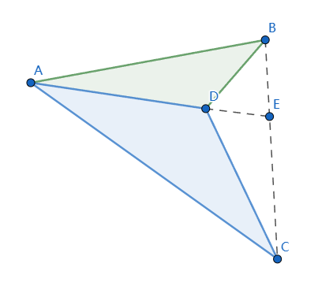
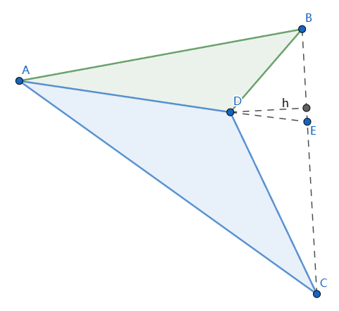

# 燕尾模型

[返回目录](index.md)

如下图

D是$\triangle{ABC}$中任意一点，直线AD交BC于E，则$\dfrac{S_{\triangle{ADB}}}{S_{\triangle{ADC}}}=\dfrac{\vert EB \vert}{\vert EC \vert}$

## 比例的性质

这里说明一种比例的性质，方便后面的证明过程。

如果 $\dfrac{a}{b}=\dfrac{c}{d}$，其中 $a, b, c, d \in \mathbb{Z}$ 且 $b \neq d$，则 $\dfrac{a}{b}=\dfrac{c}{d}=\dfrac{a-c}{b-d}$

【证明一】（我的版本）

令 $\dfrac{a}{b}=\dfrac{c}{d}=k$

则 $a=kb, c=kd$

$\therefore \dfrac{a-c}{b-d}=\dfrac{kb-kd}{b-d}=\dfrac{k(b-d)}{b-d}=k$

$\therefore \dfrac{a}{b}=\dfrac{c}{d}=\dfrac{a-c}{b-d}$

【证明二】(Charles的版本)

$\because \dfrac{a}{b}=\dfrac{c}{d}$

不妨设 $a = cn, b = dn$，其中 $n = \dfrac{a}{c}$

$\therefore \dfrac{a-c}{b-d}=\dfrac{cn-c}{dn-d}=\dfrac{c(n-1)}{d(n-1)}=\dfrac{c}{d}$

$\therefore \dfrac{a}{b}=\dfrac{c}{d}=\dfrac{a-c}{b-d}$

## 证明燕尾模型

$\triangle DEB$ 的底边 EB 和 $\triangle DEC$ 的底边 CE 在 同一条直线 BC 上，假设过D点到BC的高（垂线段）长为h，则

$S_{\triangle DEB} = \dfrac{\vert EB \vert \cdot h}{2}$, 
$S_{\triangle DEC} = \dfrac{\vert EC \vert \cdot h}{2}$

$\therefore \dfrac{S_{\triangle DEB}}{S_{\triangle DEC}} = \dfrac{\vert EB \vert}{\vert EC \vert}$

同理，
$\dfrac{S_{\triangle AEB}}{S_{\triangle AEC}} = \dfrac{\vert EB \vert}{\vert EC \vert}$

$\therefore \dfrac{\vert EB \vert}{\vert EC \vert} = \dfrac{S_{\triangle AEB}}{S_{\triangle AEC}}=\dfrac{S_{\triangle DEB}}{S_{\triangle DEC}}=\dfrac{S_{\triangle AEB} - S_{\triangle DEB}}{S_{\triangle AEC} - S_{\triangle DEC}}=\dfrac{S_{\triangle ADB}}{S_{\triangle ADC}}$ （倒数第二个式子的推导用到了前面证明过的比例性质）

证毕。