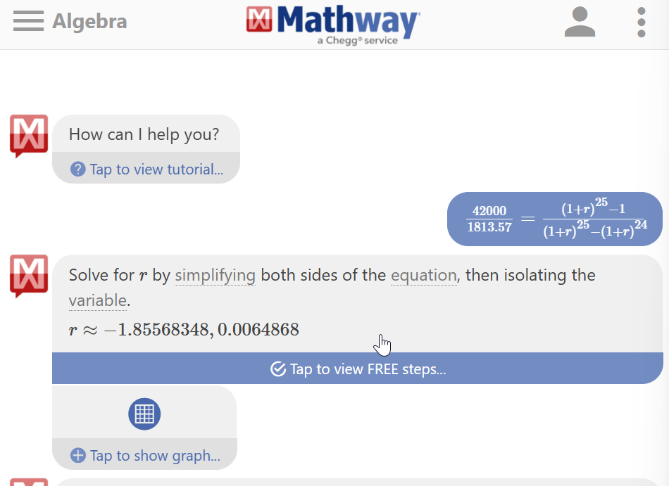

# 按月等额还款下的实际年利率计算方法

[返回目录](index.md)

2025.02.14

昨天同事 Pony 说不同的 AI 工具计算年利率的结果不一样。他的问题是：

> 借款42000元，每个月需还款1813.57元，一共24个月还完，请问实际年化利率是多少？

## AI 的错误回答

这个问题看起来非常简单，但AI的计算功能确实让人费解，我去验证了下：

* [Grok](https://x.com/i/grok/share/cLoX0txeuug8ZAkbLCwvBYm4l)的计算结果是 11.57%
* [ChatGPT](https://chatgpt.com/share/67ae7e05-8620-8004-9ffc-990869226ad7)的计算结果是 7.5%

这个差异让我有点吃惊，这两个 AI 都是平常我用得比较多的，感觉还不错的，不过，它们对同样问题，计算出来的差异居然这么大。

## 我的错误尝试

这个问题看起来确实简单，复利公式一套就解出来了。

复利公式: 

假设每个周期利率是 $r$, 所借的本金是 $a$, 则第 $n$ 个周期结束，需要偿还的债务是 $a(1+r)^n$

带入到这里

- 本金是 $42000$
- 年利率假定是 $x$
- 还款周期数 $2$
- 最终还款额 $1813.57 \times 24 = 42000(1+x)^2$

这个方程很好解，算出来的结果（正数解）是 $\sqrt{\dfrac{1813.57 \times 24}{42000} -1} \approx 0.0180 = 1.8\%$. 这个值和前面AI的结果差很多。这个值是对的吗？

## 同事的解释

我把答案提供给同事后，他说我的计算肯定是错的。他举了一个例子：

> 张三借给李四10000元，月底年利息是20%，张三的还款时间会影响到实际利率。

- 如果李四一年后直接还张三12000，那年利率就是20%
- 如果李四半年后就还张三12000，那实际的年利率其实是40%
- ……

这个解释让我陷入深思，当然我也晓得前面错了。我没有意识到实际还款周期是按月的，我的计算却是按年的，这和复利公式的使用条件不符。我打算下班之后再算一下。

## 回家后的计算——通解

我准备先把这个问题一般化，求一个通解。问题泛化为：

> 已知：借款a元，每月还m元，还n月，还完。
> 
> 求： 实际的年利率。

因为实际还款是按月的，所以可以使用复利公式先算月利率，再算年利率。

假设月利率为$r$, 第$i$月偿还的本金是$b_i$, 则每月偿还的总额为$m=b_{i}(1+r)^i$

解得 $b_{i} = \dfrac{m}{(1+r)^i}$

又，全部本金$a$为每月偿还的本金之和：$a=b_{1}+b_{2}+...+b_{n}$

即 $a=\dfrac{m}{1+r} + \dfrac{m}{(1+r)^2} + ... + \dfrac{m}{(1+r)^n}$

即 $a=m\left[\dfrac{1}{1+r} + \dfrac{1}{(1+r)^2} + ... + \dfrac{1}{(1+r)^n}\right]$

使用等比数列求和公示得 $a=m\cdot\dfrac{1 - \dfrac{1}{(1+r)^{n+1}}}{1-\dfrac{1}{1+r}}$

即 $a=m\cdot\dfrac{(1+r)^{n+1} -1}{(1+r)^{n+1} -(1+r)^{n}}$

在上面的方程中，本金$a$, 每月还款额$m$, 还款期数$n$ 都是已知的，所以可以解出月利率$r$.

假设年利率为$R$, 则根据复利公式得 $(1+r)^{12} = 1 + R$

所以年利率为 $R = (1+r)^{12} - 1$

## 最初的问题

回到最初的问题

> 借款42000元，每个月需还款1813.57元，一共24个月还完，请问实际年化利率是多少？

这里

- $a=42000$
- $m=1813.57$
- $n=24$

代入公式 $a=m\cdot\dfrac{(1+r)^{n+1} -1}{(1+r)^{n+1} -(1+r)^{n}}$ 得：

$42000=1813.57\left[\dfrac{(1+r)^{25} -1}{(1+r)^{25} -(1+r)^{24}}\right]$

使用 Mathway 解出 $r \approx 0.0064868$

所以年利率  $R = (1+r)^{12} - 1 \approx {1.0064868}^{12} - 1 \approx 0.08067972 \approx 8.07\%$

这个值和之前简单计算的年利率1.8%差了很多。

这个问题也提醒个人注意，在向银行贷款时，要明确自己的还款周期，了解个人需要承担的真实利息成本。

## 计算工具

本文用到了以下网络计算工具：

- 微软 Math Solver: <https://mathsolver.microsoft.com/en>
- Mathway: <https://www.mathway.com/Algebra>

