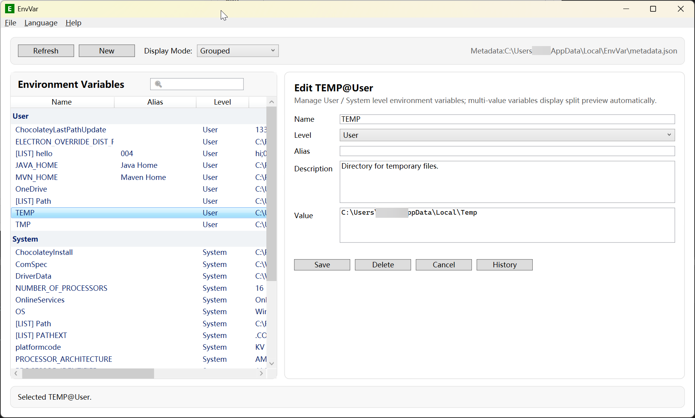
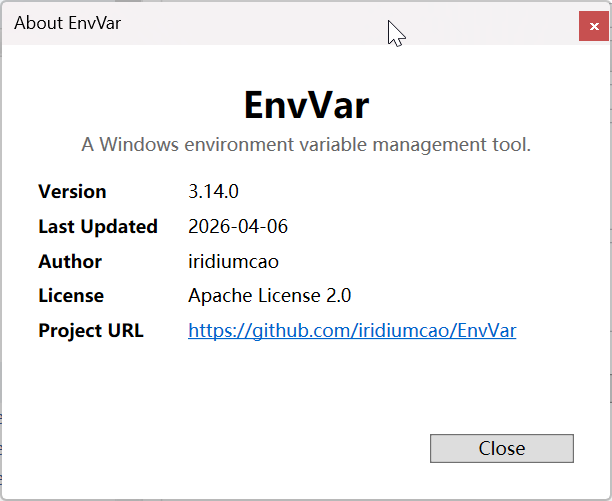

# EnvVar

2026.04.06

[Index](../other/index.md)

这个清明，我用 AI 写了一个工具软件「[环境变量管理器(EnvVar)](https://github.com/iridiumcao/EnvVar)」。最初是 Charles 抱怨说编辑环境变量麻烦，所以我打算自己写这个小工具。

时代变了，开发模式变了。在从前我要写这个工具，可能需要两个月时间，我需要：

- 学习、练习和熟悉 C#
- 一步步构建软件

不过一般情况更可能是半途而废。但这几天，我借助这些 AI：

- Github Copilot
  - Claude Opus 4.6
  - Claude Sonnet 4.6
  - GPT-5.4
- Gemini CLI
  - gemini-3.1-pro
  - gemini-3-flash
- Web
  - Grok
  - ChatGPT

在两天左右的时间完成了项目的第一个版本。

我最主要的工作是，提出初期的项目需求，检验 AI 实施情况，跟踪反馈，从编码者的角色变成了产品经理+项目经理，程序员的活基本上让 AI 干完了。几天的编码和调试的工作量，AI 十几分钟就干好了。我的具体时间耗用大概如下：

- (半天) 构思，并和 ChatGPT 讨论，确定需求
- (大半天) 安装 .NET 开发环境和学习使用 Visual Studio
- (一天多) 通过 AI 开发项目，并完成安装和发布脚本制作

行业已经发生巨变，个人前路未知。

## 用 AI 编程的一点体会

- 代码、文档和测试用例，要同步修改。
- 一次不要让 AI 做太多事情，最好一次一件，清楚明了。如果怕交互太多，费时间，费 token，在任务比较简单时，可以几个一起，但最好不好超过5个。我的经验是超过5个很容易中途中断——耗时太长，执行不完。
- 一定要把问题描述清楚。用中文或英文几乎没差别。
- 不同模型的编程能力差别很大，尽量选用更好的模型，哪怕贵一点。
- 你懂的越多，便能使用 AI 做的越好。平时要注意学习和体会，不能全部寄希望于 AI。AI 是一个超级助手和至强战士，但不是你的替代。
- AI 的能力和它的训练时的材料的多寡和质量很有相关性。如果你要处理的事情刚好比较小众，就更需要自己的知识储备和判断。
- 国内网络很卡，非常影响和 AI 的交互。

