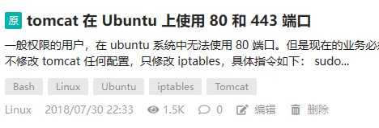

# Tomcat 在 Ubuntu 上使用 80 和 443 端口

一般权限的用户，在 ubuntu 系统中无法使用 80 端口。但是现在的业务必须使用 80 和 443，网上有多种方法介绍，但最简单的是不修改 tomcat 任何配置，只修改 iptables，具体指令如下：

```bash
sudo iptables -t nat -A PREROUTING -p tcp --dport 80 -j REDIRECT --to-port 8080
sudo iptables -t nat -I OUTPUT -p tcp -d 127.0.0.1 --dport 80 -j REDIRECT --to-ports 8080
sudo iptables -t nat -I OUTPUT -p tcp -d localhost --dport 80 -j REDIRECT --to-ports 8080

sudo iptables -t nat -A PREROUTING -p tcp --dport 443 -j REDIRECT --to-port 8443
sudo iptables -t nat -I OUTPUT -p tcp -d 127.0.0.1 --dport 443 -j REDIRECT --to-ports 8443
sudo iptables -t nat -I OUTPUT -p tcp -d localhost --dport 443 -j REDIRECT --to-ports 8443
```

参考：https://serverfault.com/questions/112795/how-to-run-a-server-on-port-80-as-a-normal-user-on-linux

---

本文最早发布在OSC上，现在搬运过来，原文已删除。
