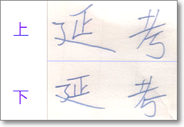
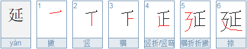
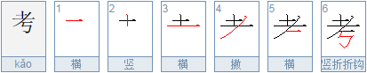

# 极易写错的汉字：延，考

「延」和「考」两字在手写时，极易写错，而且作者不察，读者亦不察！

请看下面两种写法：

粗看去上下基本上一致，况手写时本来就有笔画变形，其实，上面为规范的写法，下面是误写，具体说明如下：

「延」字右上部分的第四笔是竖折，而非竖与横。

「考」字右下部分的横，是折笔之上。

上面的笔顺图和两字的笔顺演示可参：

1. 「延」<http://bihua.51240.com/e5bbb6__bihuachaxun/>
2. 「考」<http://bihua.51240.com/e88083__bihuachaxun/>

后记：之所以发现「延」的书写问题，是因为我用手机笔画输入法时，总是打不出这个字，才知道自己写错了。可叹，可叹！

